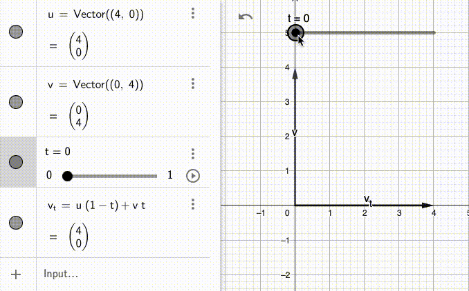
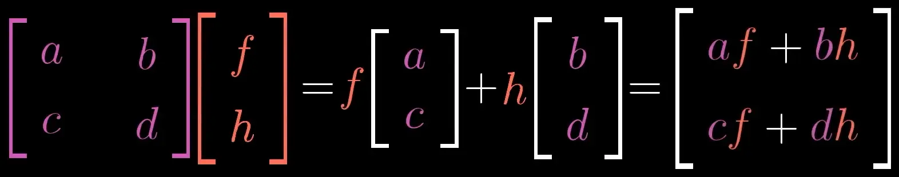
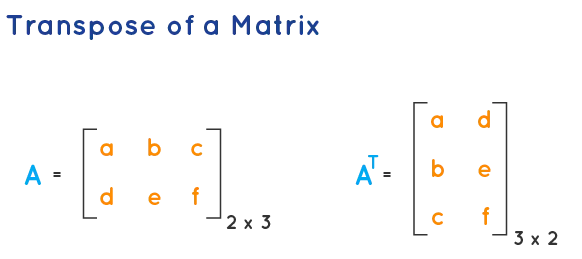
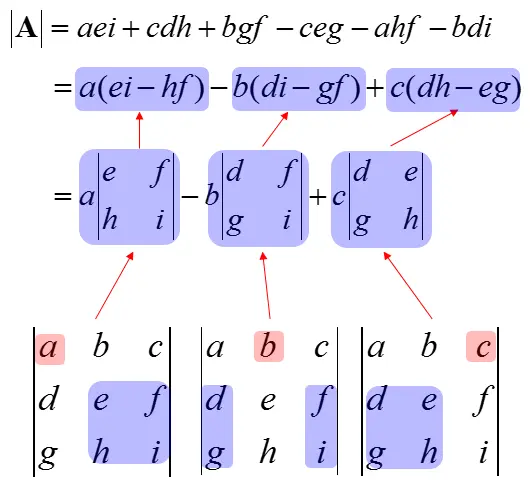

<h1 align="center">matrix</h1>

**`matrix` is a 42 project covering linear algebra.**

> *⚠️ This guide assumes you have watched or are watching the awesome [Essence of Linear Algebra](https://www.youtube.com/playlist?list=PLZHQObOWTQDPD3MizzM2xVFitgF8hE_ab) series by 3Blue1Brown.*
>
> *Moreover, it will mostly focus on the linear algebra part of the project, and less on the specificities of Rust or other implementation details.*

## Table of Contents

- [Exercises](#exercises) 🏋🏻
    - [00 - Add, Subtract and Scale](#00---add-subtract-and-scale) 🔣
    - [01 - Linear combination](#01---linear-combination) 🔗
    - [02 - Linear interpolation](#02---linear-interpolation) 1️⃣1️
    - [03 - Dot product](#03---dot-product) 🎯
    - [04 - Norm](#04---norm) 📏
    - [05 - Cosine](#05---cosine) 📐
    - [06 - Cross product](#06---cross-product) ✖️
    - [07 - Matrix multiplication](#07---matrix-multiplication) ✖️
    - [08 - Trace](#08---trace) ➕
    - [09 - Transpose](#09---transpose) 🔄
    - [10 - Row echelon form](#10---row-echelon-form) 📉
    - [11 - Determinant](#11---determinant) 📊
    - [12 - Inverse](#12---inverse) 🔁
    - [13 - Rank](#13---rank) 📈
- [Resources](#resources) 📖

## Exercises

### 00 - Add, Subtract and Scale

> ```rust
> fn add(&mut self, v: &Matrix<K>);
> fn sub(&mut self, v: &Matrix<K>);
> fn scl(&mut self, a: K);
> ```
>
> Maximum time complexity : $O(n)$
>
> Maximum space complexity : $O(n)$

This exercise is pretty straightforward:

- The addition and subtraction can only be done with matrices of the same shape, and is the result of **adding or subtracting each element of the first matrix with the corresponding element of the second matrix**.
- The scaling depends on a scalar, and is the result of **multiplying each element of the matrix by the scalar**.

### 01 - Linear combination

> ```rust
> fn linear_combination<K>(u: &[Vector<K>], coefs: &[K]) -> Vector<K>;
> ```
>
> Maximum time complexity : $O(n)$
>
> Maximum space complexity : $O(n)$

Linear combination is the result of **adding the result of multiplying each vector by its corresponding coefficient**.

For example, the linear combination of the vectors $[1, 2]$ and $[3, 4]$ with the respective coefficients $2$ and $3$ is the vector $[11, 16]$.

### 02 - Linear interpolation

> ```rust
> fn lerp<V>(u: V, v: V, t: f32) -> V;
> ```
>
> Maximum time complexity : $O(n)$
>
> Maximum space complexity : $O(n)$

Interpolating two numbers $u$ and $v$ with a factor $t$ (being $0 \leq t \leq 1$) vulgarly means **finding the number that is $t$ percent between $u$ and $v$**.

For example, $\text{lerp}(1, 3, 0.5) = 2$, because $2$ is halfway between $1$ and $3$. Simple.

With vectors, it is easier to visualize. Finding the linear interpolation between two vectors $u$ and $v$ would roughly mean:

1. Drawing an imaginary line between the extremities of the vectors.
2. Finding the point that is $t$ percent between the two extremities.
3. Create a vector that points to there.

<p align="center">
    
</p>

Here, $V_t = \text{lerp}(u, v, t)$ points at the point that is $t\%$ between $u$ and $v$.

Find the formula for the linear interpolation of two numbers in the GIF!

If you implemented well the previous exercises, this one should be a piece of cake: just overload the operators with your functions!

> 💡 Rust's syntax can sometimes be a pain, so here is a tip:
>
> ```rust
> fn lerp<
>    V: std::fmt::Display
>       + std::ops::Add<Output = V>
>       + std::ops::Sub<Output = V>
>       + std::ops::Mul<f32, Output = V>
> >
> ```
>
> Basically tells "this function will take any custom type `V`, as long as it implements `Display` (to print it), `Add`, `Sub` and a `Mul` that takes a `f32` and returns a `V`".

With all these tips, you should be able to implement `lerp` in one line!

### 03 - Dot product

> ```rust
> impl<K> Vector<K> {
>   fn dot<K>(&self, v: Vector<K>) -> K;
> }
> ```
>
> Maximum time complexity : $O(n)$
>
> Maximum space complexity : $O(n)$

The dot product of two vectors is the **weighted sum of the elements of the vectors**.

For example:

$$
\begin{bmatrix}
1 \\ 2
\end{bmatrix}
\cdot
\begin{bmatrix}
3 \\ 4
\end{bmatrix}
= 1 \times 3 + 2 \times 4
= 11
$$

Simple.

### 04 - Norm

> ```rust
> impl<K> Vector<K> {
>   fn norm_1(&self) -> f32;
>   fn norm(&self) -> f32;
>   fn norm_inf(&self) -> f32;
> }
> ```
>
> Maximum time complexity : $O(n)$
>
> Maximum space complexity : $O(n)$

The norms to implement are:

- **$l_1$ norm**: $\|v\|_1$ (also called the Taxicab norm or Manhattan norm)
    - **Definition**: the sum of the absolute values of the elements of the vector.
    - **Geometrically**: the distance traveled if you can only move along the axes.

- **$l_2$ norm**: $\|v\|$ or $\|v\|_2$ (also called the Euclidean norm)
    - **Definition**: the square root of the sum of the squares of the elements of the vector.
    - **Geometrically**: the length of the vector.

- **$l_\infty$ norm**: $\|v\|_\infty$ (also called the supremum norm or uniform norm)
    - **Definition**: the maximum absolute value of the elements of the vector.
    - **Geometrically**: the maximum distance traveled along one axis. For example, if your vector travels 3 units along $x$ and 4 units along the $y$, the $l_\infty$ norm would be 4.

### 05 - Cosine

> ```rust
> fn angle_cos<K>(u: &Vector<K>, v: &Vector<K>) -> f32;
> ```
>
> Maximum time complexity : $O(n)$
>
> Maximum space complexity : $O(n)$

The cosine of the angle between two vectors is **their dot product, divided by the product of their norms**. Simple.

As the subject says, *"use the functions you wrote during the two previous exercises"*.

### 06 - Cross product

> ```rust
> fn cross_product<K>(u: &Vector<K>, v: &Vector<K>) -> Vector<K>;
> ```

The cross product of two vectors outputs a vector that is perpendicular to the plane formed by the two vectors.

For example:

$$
\begin{bmatrix}
1 \\ 0 \\ 0
\end{bmatrix}
\times
\begin{bmatrix}
0 \\ 1 \\ 0
\end{bmatrix}
= \begin{bmatrix}
0 \\ 0 \\ 1
\end{bmatrix}
$$

Here the two vectors form the $xy$ plane, and the cross product points in the $z$ direction.

The cross product is only defined for two $(3, 1)$ vectors, and the formula can be found in the *Cross product* [Wikipedia page](https://en.wikipedia.org/wiki/Cross_product#Matrix_notation).

However, it has other interesting properties, have a look at the [Cross product](https://www.youtube.com/watch?v=eu6i7WJeinw) video of the *Essence of Linear Algebra* series.

### 07 - Matrix multiplication

> ```rust
> fn mul_vec<K>(&mut self, vec: Vector<K>) -> Vector<K>;
> fn mul_mat<K>(&mut self, mat: Matrix<K>) -> Matrix<K>;
> ```
>
> Maximum time complexity:
> - $O(nm)$ for `mul_vec`, with a matrix of shape $(m, n)$ and a vector of length $n$.
> - $O(nmp)$ for `mul_mat`, with a matrix of shape $(m, n)$ and a matrix of shape $(n, p)$.
>
> Maximum space complexity:
> - $O(nm)$ for `mul_vec`.
> - $O(nm + mp + np)$ for `mul_mat`.

Matrix multiplication can be done either with a vector, or with another matrix.

#### Matrix-vector multiplication

For a matrix $A$ of shape $(m, n)$ and a vector $v$ of length $n$, the product $Av$ is a vector of length $m$.

Each element of the resulting vector is multiplied by the corresponding column of the matrix, and then summed.

<p align="center">
    
</p>

> *Here is a visual representation of the matrix-vector multiplication, from the Essence of linear algebra series. Watch the [full video](https://www.youtube.com/watch?v=XkY2DOUCWMU).*

#### Matrix-matrix multiplication

For a matrix $A$ of shape $(m, n)$ and a matrix $B$ of shape $(n, p)$, the product $AB$ is a matrix of shape $(m, p)$.

**Each column of the resulting matrix is the result of the matrix-vector multiplication of the matrix $A$ with its corresponding column of the matrix $B$**.

It would not be wise to give you more than this explanation, so once again, watch the full video mentioned above, and make sure you get a good grasp of the concept.

> 💡 Depending on your implementation, it might be a good choice to implement the **transpose** operation now, instead of when you reach ex09.

### 08 - Trace

> ```rust
> fn trace(&self) -> K;
> ```
>
> Maximum time complexity : $O(n)$

**The trace of a square matrix is the sum of the elements of its main diagonal.**

For example:

$$
\text{trace}
\left(
    \begin{bmatrix}
    1 & 2 & 3 \\
    4 & 5 & 6 \\
    7 & 8 & 9
    \end{bmatrix}
\right)
= 1 + 5 + 9 = 15
$$

Pretty simple, right?

It is a component of more complex, interesting concepts, check out [this video](https://www.youtube.com/watch?v=PFDu9oVAE-g) for more information.

### 09 - Transpose

> ```rust
> fn transpose(&self) -> Matrix<K>;
> ```
>
> Maximum time complexity : $O(nm)$
>
> Maximum space complexity : $O(nm)$

**The transpose of a matrix can be seen as mirroring it**, along the main diagonal for a square matrix.

It can also be seen as the result of swapping the rows and columns of the matrix.

<p align="center">
    
</p>

Implementing it is simply two nested loops, swapping the elements of the matrix.

### 10 - Row echelon form

> ```rust
> pub fn row_echelon(&self) -> Matrix<K>;
> ```
>
> Maximum time complexity : $O(n^3)$
>
> Maximum space complexity : $O(n^2)$

The row echelon form ($\text{REF}$) of a matrix is the result of applying a series of operations to the matrix, in order to have the following properties:

1. The first non-zero element of each row is $1$.
2. The first non-zero element of each row is to the right of the first non-zero element of the row above.

Its main use case is solving systems of linear equations. Let's say you have the following system:

$$
\begin{cases}
x + 2y + 3z = 4 \\
4x + 5y + 6z = 7 \\
7x + 8y + 9z = 10
\end{cases}
$$

You can write it as an augmented matrix:

$$
\left[
    \begin{array}{ccc|c}
    1 & 2 & 3 & 4 \\
    4 & 5 & 6 & 7 \\
    7 & 8 & 9 & 10
    \end{array}
\right]
$$

And its $\text{REF}$ would be:

$$
\left[
    \begin{array}{ccc|c}
    1 & 2 & 3 & 4 \\
    0 & 1 & 2 & 3 \\
    0 & 0 & 1 & 2
    \end{array}
\right]
$$

This means that:

- *Third row*: $1z = 2$, therefore $z = 2$.
- *Second row*: $1y + 2z = 3$, then $y + 4 = 3$, so $y = -1$.
- *First row*: $1x + 2y + 3z = 4$, then $x - 2 + 6 = 4$, so $x = 0$.

> What we just did is called **back substitution**.
>
> This explanation can be a bit shallow, so if you are still confused, take a look at [this video](https://www.youtube.com/watch?v=2tlwSqblrvU).

Now, how to get to the $\text{REF}$?

1. Find the first row with a non-zero element in the first column.
2. If it is not the first row, swap it with the first row.
3. Keep track of what is called the **pivot** element (the first non-zero element of the row). It will increase by one at each iteration.
4. For each row below the current one, subtract a multiple of the current row to make the elements below the pivot zero.
5. Repeat the process for the next row.

Implementing this as code is a very complex task, so I suggest you look at the [Rosetta Code](https://rosettacode.org/wiki/Reduced_row_echelon_form) page to wrap your head around it and get some inspiration.

### 11 - Determinant

> ```rust
> pub fn determinant(&self) -> K;
> ```
>
> Maximum time complexity : $O(n^3)$
>
> Maximum space complexity : $O(n^2)$

Matrices are more than rows and columns, they correspond to geometric linear transformations.

A matrix changes the space it operates in.

For example, it can rotate, scale, or shear it, and thus, affect any object in this space (e.g. a vector).

The **determinant** of a matrix is a scalar that represents how much the matrix increases/reduces the space it operates in.

If a matrix scales everything by a factor of $2$, its determinant will be $2$.

Once again, 3Blue1Brown has a great video on the subject, [check it out here](https://www.youtube.com/watch?v=Ip3X9LOh2dk).

For a 2x2 matrix, the determinant is calculated as follows:

$$
\left|
\begin{array}{cc}
a & b \\
c & d
\end{array}
\right| = ad - bc
$$

For a 3x3 matrix:

<p align="center">
    
</p>

It would be a bit tedious to implement a function for each case as the subject asks, so I suggest you implement a general function that can calculate the determinant of any square matrix.

Do you see the pattern here?

The determinant of a 3x3 matrix is calculated by:

1. Taking each element $x$ of the first row.
2. Multiplying it by the determinant of the matrix that remains when you remove the $i_x$ row and the $j_x$ column.

This is called the **Laplace expansion**.

Recursively, you can calculate the determinant of any square matrix.

### 12 - Inverse

> ```rust
> fn inverse(&self) -> Result<Matrix::<K>, _>;
> ```
>
> Maximum time complexity : $O(n^3)$
>
> Maximum space complexity : $O(n^2)$

The inverse of a matrix is the matrix that, when multiplied by the original matrix, gives the identity matrix.

Remember that matrices exist to represent transformations.

In simpler terms, **the inverse of a matrix is the matrix that "undoes" the original transformation**.

> Example: if a matrix scales everything by a factor of $2$, its inverse will scale everything by a factor of $0.5$.

There is a very cool method to calculate the inverse of a matrix, using calculations similar to the determinant's, but it is of time complexity $O(n^4)$, and the subject asks for a $O(n^3)$ solution.

> [Click here](https://www.youtube.com/watch?v=YvjkPF6C_LI) if you are curious about it.

So, we will implement another one, that leverages the **Gauss-Jordan elimination** method, already implemented in [ex10](#10---row-echelon-form).

This method consists of augmenting the matrix with its identity matrix, and applying the reduced row echelon form method to the augmented matrix.

> 💡 The **reduced** row echelon form is a more restrictive set of the row echelon form, with an additional rule of having only zeros in the same column as the pivot 1's.
>
> For example:
>
> $$
> \begin{bmatrix}
>     1 & 2 & 3 \\
>     0 & 1 & 2 \\
>     0 & 0 & 1
> \end{bmatrix}
> $$
>
> is in row echelon form, but not in reduced row echelon form.

Let's say we have the following matrix:

$$
\left[
    \begin{array}{cc}
    1 & 3 \\
    2 & 5
    \end{array}
\right]
$$

We augment it with its identity matrix (a zero-ed matrix of same shape, with ones on the main diagonal):

$$
\left[
    \begin{array}{cc|cc}
    1 & 3 & 1 & 0 \\
    2 & 5 & 0 & 1
    \end{array}
\right]
$$

And apply the reduced row echelon form method to it:

$$
\left[
    \begin{array}{cc|cc}
    1 & 0 & -5 & 3 \\
    0 & 1 & 2 & -1
    \end{array}
\right]
$$

The right side of the augmented matrix is the inverse of the original matrix. We only have to extract it!

### 13 - Rank

> ```rust
> fn rank(&self) -> usize;
> ```
>
> Maximum time complexity : $O(n^3)$
>
> Maximum space complexity : $O(n^2)$

The **rank** of a matrix indicates how "compressed" space is after the transformation.

For example, if a matrix takes a 3D space and compresses it to a 2D space, its rank will be $2$.

Watch [this video](https://www.youtube.com/watch?v=uQhTuRlWMxw) (3Blue1Brown again) to have a visual representation of the rank.

We can compute the rank of a matrix by **counting the number of non-zero rows in its reduced row echelon form**.

Let's say we have the following $RREF$:

$$
\left[
    \begin{array}{ccc}
    1 & 2 & 3 \\
    0 & 1 & 2 \\
    0 & 0 & 0
    \end{array}
\right]
$$

The rank of this matrix would be $2$. Simple!

## Resources

- [📺 YouTube − The Lp Norm for Vectors and Functions](https://www.youtube.com/watch?v=NKuLYRui-NU)
- [📖 Wikipedia − Cross product (Matrix notation)](https://en.wikipedia.org/wiki/Cross_product#Matrix_notation)
- [📺 YouTube − Gaussian Elimination](https://www.youtube.com/watch?v=2tlwSqblrvU) (helps to understand the point of REF)
- [📖 Rosetta Code − Reduced row echelon form](https://rosettacode.org/wiki/Reduced_row_echelon_form)
- [📺 YouTube − Finding the Inverse of a 3 x 3 Matrix using Determinants and Cofactors](https://www.youtube.com/watch?v=YvjkPF6C_LI) ($n^4$ time complexity)
- [📺 YouTube − Inverse Matrix Using Gauss-Jordan / Row Reduction](https://www.youtube.com/watch?v=cJg2AuSFdjw)
